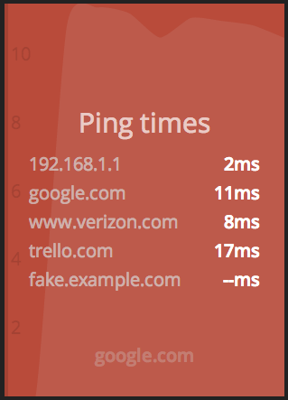

# Ping widget

## Installation

* Edit `jobs/ping.rb` and change the list of servers you wish to ping.
* Copy the contents of the `jobs` and `widgets` directories to your dashing
  project.
* Add the widget to your dashboards/foo.html page.

## Example usage

    <li data-row="1" data-col="3" data-sizex="1" data-sizey="1">
      

    </li>
